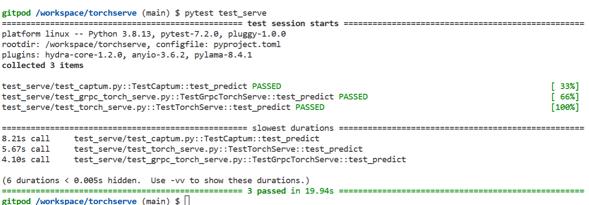
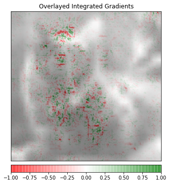
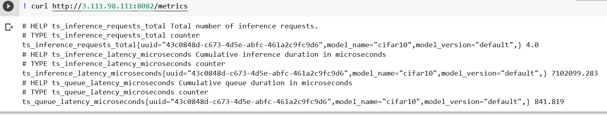
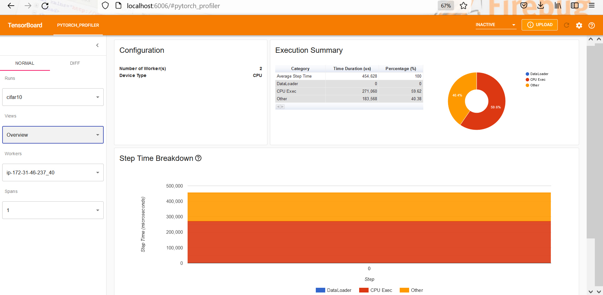

Torchserv

## Step1:
Train Model on Colab for 10 epochs and download scripted model model.script.pt 

## Step2:
Create a mar use using the command

conda install -c pytorch torchserve torch-model-archiver torch-workflow-archiver
torch-model-archiver --model-name cifar10 --version 1.0 --serialized-file model.script.pt --handler src/pytorch_handlers/cifar10_handler.py --extra-files  /src/pytorch_handlers/cifar10_classes/index_to_name.json

## Step3:
Start torchserve server in EC2 instancew:

Create a directory model_store and copy the cifar10.mar file 

docker run -it --rm --net=host -v \`pwd\`:/opt/src pytorch/torchserve:latest bash

cd /opt/src

torchserve --model-store model_store --start --models all --ts-config config.properties

config.properties has following content:

inference_address=http://0.0.0.0:8080
management_address=http://0.0.0.0:8081
metrics_address=http://0.0.0.0:8082
grpc_inference_port=7070
grpc_management_port=7071
  
 ## Testing locally
  
  pytest test_serve
  
  

# Pytest Output

  
  # Captum Output

  # Metrics Output

# Tensorboard Profile

